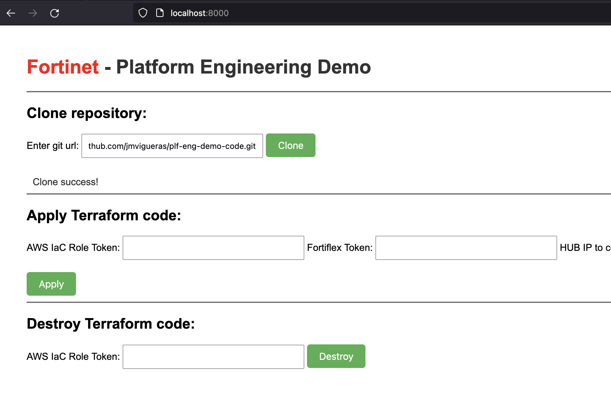
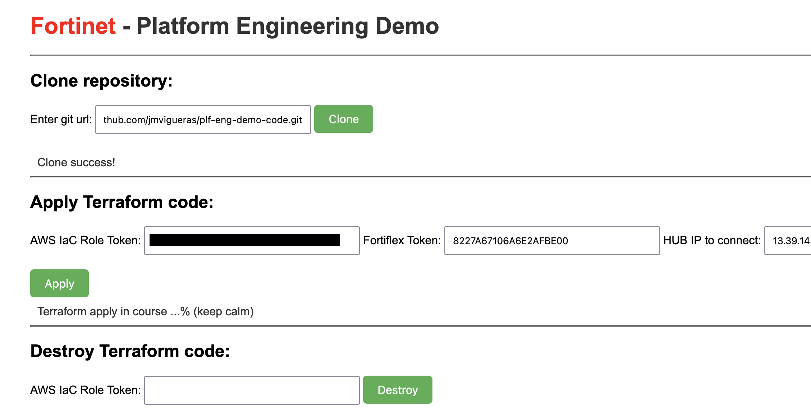
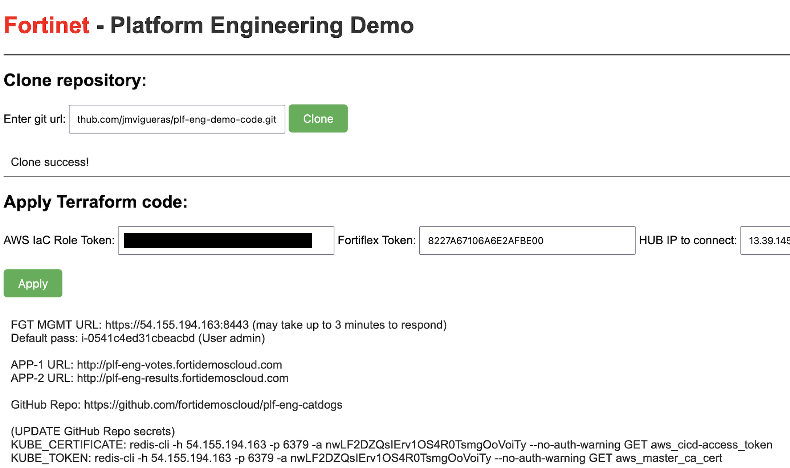
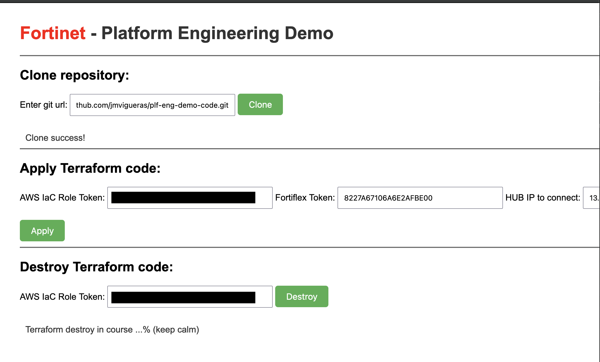

# Fortinet Platform Engineering - API and WEB containers
## Deploy Terraform with this app

This project has the goal to showcase how can be possible to implement a platform to provide developers a safe environment to deploy their apps. It is based on Terraform to deploy infrastructure in Cloud and API calls to configure SaaS services as GitHub or Fortinet FortiWEB Cloud WAAP.

## Introduction

You can find these folders:
* [0_deploy_fgt_hub](./0_deploy_fgt_hub/) (optional): an example of Terraform deployment of a Fortigate NGFW within AWS acting as a SDWAN HUB.
* [1_deploy_plf_eng_app](./1_deploy_plf_eng_app/): this folder contains the platform containers servers to deploy Terraform code.

## Requirements
* Docker container server
* Docker compose

## Deployment
* (Optional) Deploy Fortigate in AWS acting as a SDWAN HUB (follow this [repo](https://github.com/jmvigueras/modules/tree/main/aws/examples/fgt-ha-2az_onramp) for guidance)
* Go to [1_deploy_plf_eng_app](./1_deploy_plf_eng_app/)
* Update enviroments variables for container [docker-compose.yml.example](./1_deploy_plf_eng_app/docker-compose.yml.example)
```
      TF_VAR_access_key: '{{access_key}}'
      TF_VAR_secret_key: '{{secret_key}}'
      TF_VAR_aws_role_arn: '{{aws_role_arn}}'
      TF_VAR_fwb_cloud_token: '{{fwb_cloud_token}}'
      TF_VAR_github_token: '{{github_token}}'
      TF_VAR_fortidevsec_org: '{{fortidevsec_org}}'
      TF_VAR_fortidevsec_app: '{{fortidevsec_app}}' 
```
* Rename to docker-compose.yml
* Build local container images:
```
# docker build -t web-plf-eng:v1 ./web_plf_eng
# docker build -t api-plf-eng:v1 ./api_plf_eng   
```
* Create new network in docker: 
```
# docker network create net-plf-eng
```
* Deploy containers:
 ```
# docker-compose up -d
```

## How to
* After run container connect to http://localhost:8000
* Clone repository url: https://github.com/jmvigueras/plf-eng-demo-code.git



* Deploy Terraform code (The platform asks for an AWS external id to adquire the role to deploy).
* Add FortiFlex token to license the FGT (VM02).
* (Terraform variables) variables are also defined as environment variables when container image has been created in [docker-compose.yml](./1_deploy_plf_eng_app/docker-compose.yml.example)



* After successful deploy outputs will appears



**READ**

The deployed Terrafom code has created the following resources:

- AWS VPC and necessary subnets.
- Fortigate NGFW.
- Kubernetes self-managed cluster.
- AWS Route53 DNS records.
- FortiWEB Cloud new APPs.
- GitHub repository (secrests and workflow action).

It is mandatory to provide necessary API tokens to configure all those services.

* Destroy



# Support
This a personal repository with goal of testing and demo Fortinet solutions on the Cloud. No support is provided and must be used by your own responsability. Cloud Providers will charge for this deployments, please take it in count before proceed.

## License
[License](./LICENSE)

